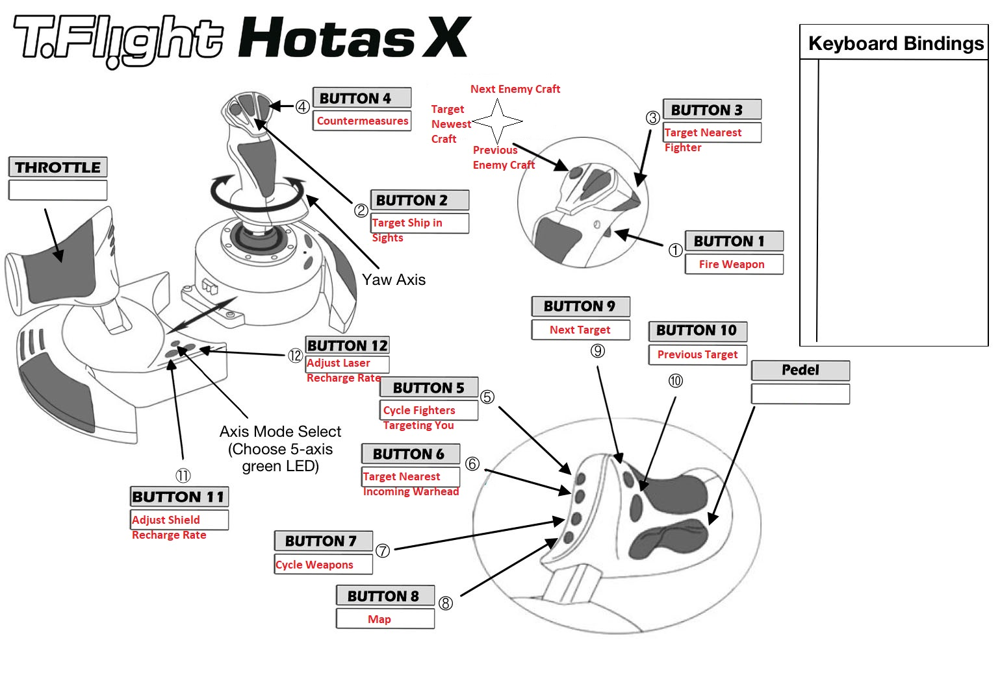
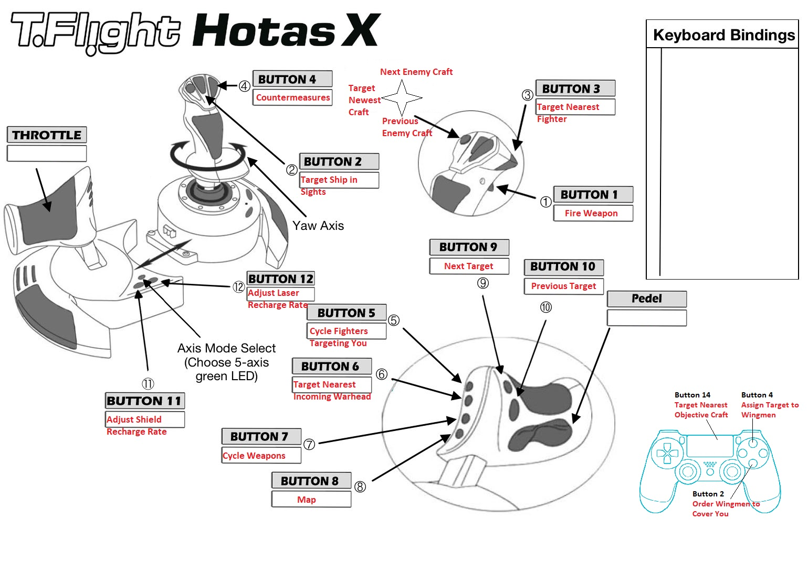

# Thrustmaster T-Flight Hotas X

## :material-cog: Profile 1
Mapping for JoystickConfig file: [JoystickConfigHotasX.txt](./t-flight-hotas-x/profile-1/JoystickConfigHotasX.txt)

---

## :material-cog: Profile 2
Mapping for JoystickConfig file: [JoystickConfigHotasXDS4_Opt.txt](./t-flight-hotas-x/profile-2/JoystickConfigHotasXDS4_Opt.txt)

