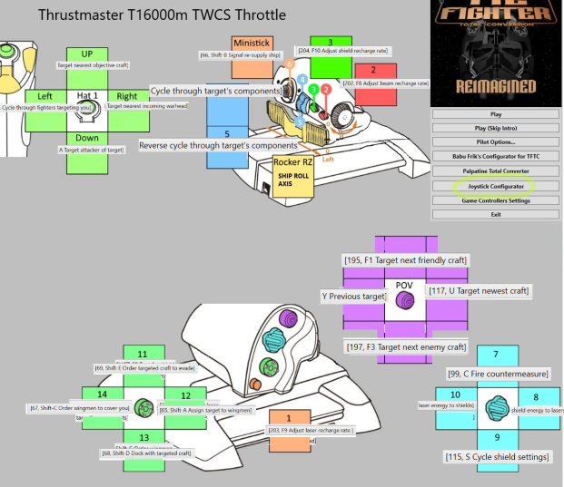
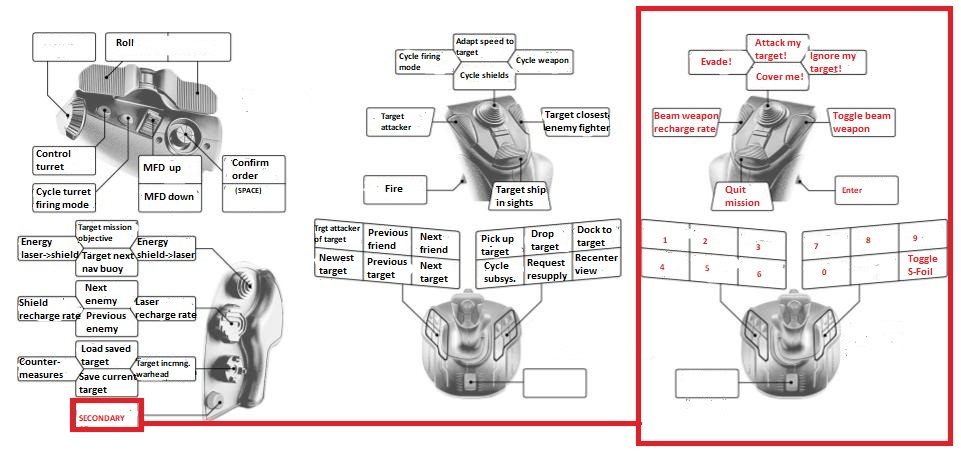

# Thrustmaster T.16000M

## :material-cog: Profile 1

### Config Files

[Thrustmaster_t16000m_fcs_JoystickConfig.txt](./t.16000m/profile-1/Thrustmaster_t16000m_fcs_JoystickConfig.txt)

[T16000m_TWCS_Hota_JoystickConfig.txt](./t.16000m/profile-1/T16000m_TWCS_Hota_JoystickConfig.txt)

[TFTC_TARGET_T16000m_fcs.fcf](./t.16000m/profile-1/TFTC_TARGET_T16000m_fcs.fcf)

[Thrustmaster_t16000m_XwA-with-roll-and-throttle.fcf](./t.16000m/profile-1/Thrustmaster_t16000m_XwA-with-roll-and-throttle.fcf)

### Config Maps

[TARGET_TFTC_t1600m_fcs_bindings.pdf](./t.16000m/profile-1/TARGET_TFTC_t16000m_fcs_bindings.pdf)

---

## :material-cog: Profile 2

This binding uses [Joystick Gremlin](https://whitemagic.github.io/JoystickGremlin/) and [vJoy](https://sourceforge.net/projects/vjoystick/).

To use it, first install vJoy and set it up. This virtually combines your throttle and joystick into one device that X-Wing Alliance can use.

You need to go to the Joystick Configurator in the XWA Upgrade launcher and make sure it uses the "vJoy Device" as the joystick. Here, you must also set up the axis. In the "Buttons" tab, select the following:

- joybutton_0_1: Alt-2 Fire Weapon
- joybutton_0_2: Alt-1 Pick target in sight
- The rest of the buttons is unimportant and can be set to "None No funtion"

Then, install Joystick Gremlin and start it, then load [JoystickGremlinAlliance.xml](./t.16000m/profile-2/JoystickGremlinAlliance.xml) file by selecting `File > Load Profile > JoystickGremlinAlliance.xml`.
Press the `Activate` button (looks like a game controller). The profile needs to be activated in this manner every time you want to play.

