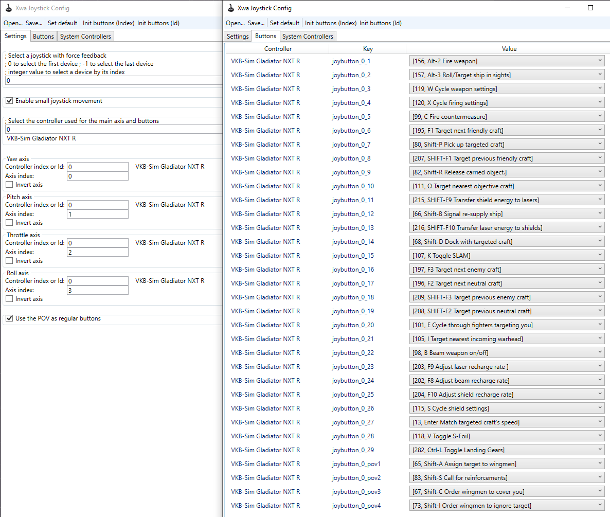

# VKB Gladiator NXT Premium

## :material-cog: Profile 1

[JoystickConfig.txt](./vkb-gladiator-nxt-premium/profile-1/JoystickConfig.txt) 

Submitted by **Canzah**

it's mostly customized for my own preference/comfort but it covers the most important bits. Contrary to most profiles I saw from other people, this one doesn't have the navbuoy or hyperspace bound on it as in my personal belief binding those to stick is waste of button space on stick and are fine enough being on keyboard.

