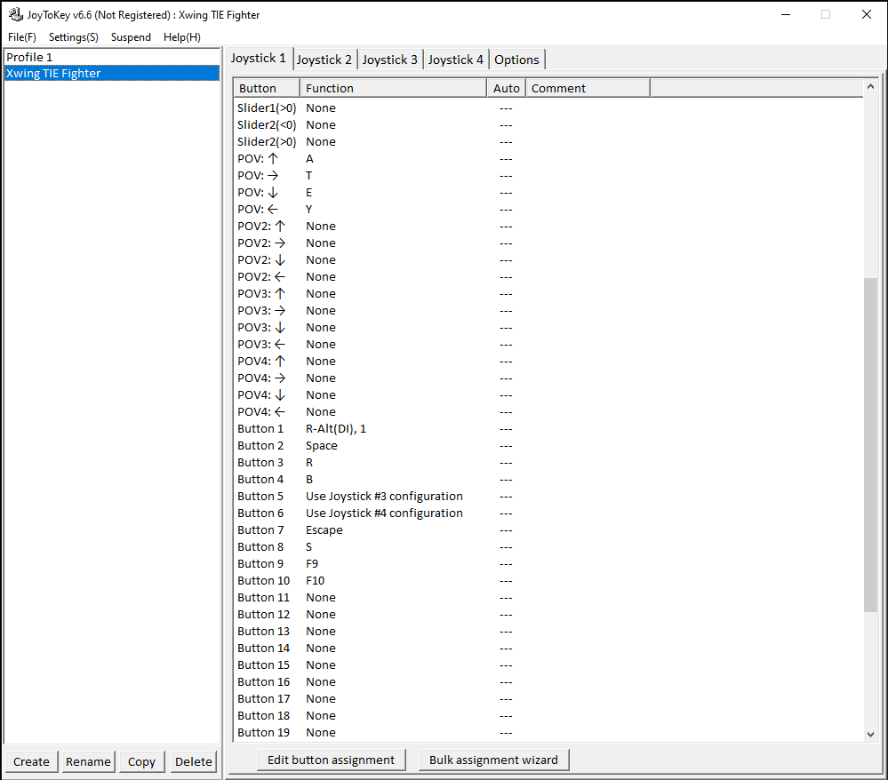
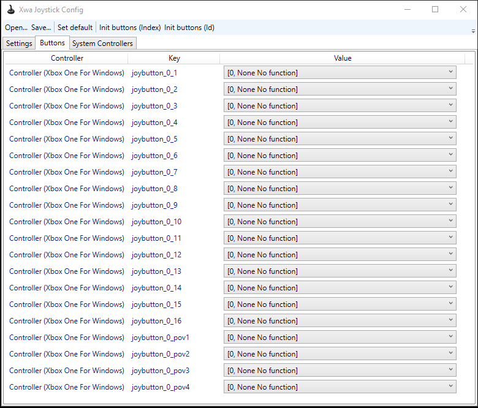
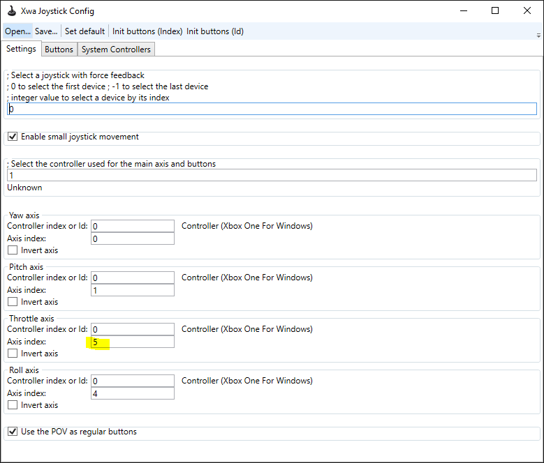
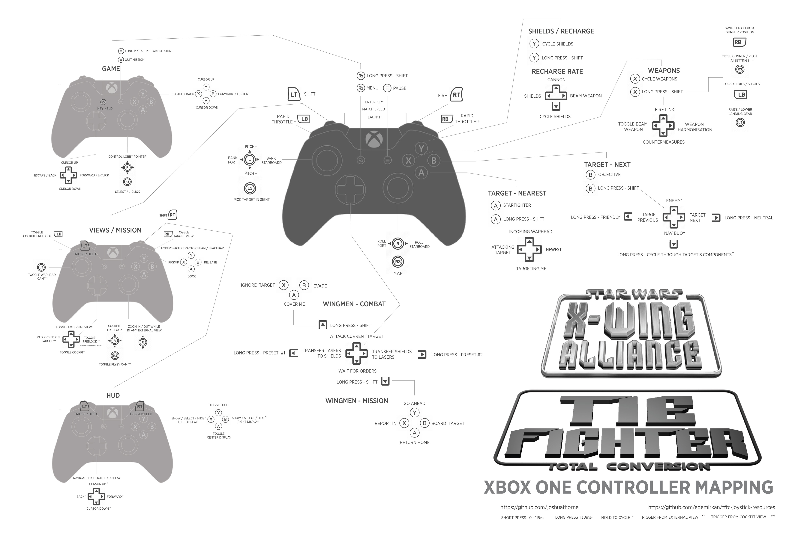
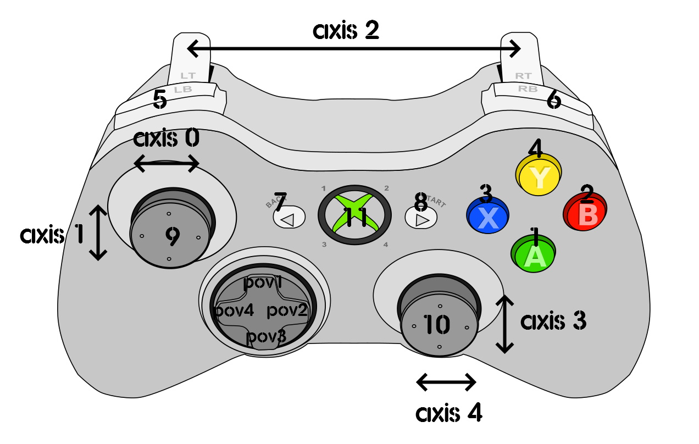

# Xbox One Controller 

## :material-cog: Profile 1

Submitted by aveferrum

Unfortunately, `Xwa Joystick Configurator` has limited functionality to configure your gamepad for advanced use cases. If you'd like use triggers as buttons (eg. to fire weapons) or switch to alternative layouts based on a button press, you'll need to disable assignments in the configurator and override them with a more advanced mapping application. I described usage of Joytokey below, but any other app can be used in that fashion. 

### How to setup Joytokey for TFTC

1. Download and install [JoyToKey](https://joytokey.net/en/download). JoyToKey is a shareware application which you can freely download and evaluate without any limitation in functionality.
2. Copy the [Xwing_TIE_Fighter.cfg](./xbox-one/profile-1/Xwing_TIE_Fighter.cfg) file to your Joytokey profile folder, which should be `C:\Users\your-user-name\Documents\JoyToKey` by default. Once copied, it should be listed within the profile list on the left as shown below.

3. Open up your `Xwa Joystick Configurator` and set your buttons to `[0, None No function]` and the Throttle axis to 5. The idea here is to nullify Xwa's own joystick configuration and override it with Joytokey instead. Setting the Throttle axis to a non-valid axis index will effectively disable it. You can also use the `JoystickConfig.txt` listed here, simply using the `Open...` menu and saving over your configuration.

4. Keep the Joytokey application open and start the game.

### Xbox Gamepad button - key mapping

| Gamepad                              | Key                 | Functionality           |
|:-------------                        |:--------            |:------                  |
| Button - A                           | Alt-1               | Pick target in sight    |
| Button - B                           | Space               | Confirm critical orders |
| Button - X                           | R                   | Target nearest fighter  |
| Button - Y                           | B                   | Beam weapon on/off      |
| Left Stick - Left                    | Managed by XWa      | Yaw Left                |
| Left Stick - Right                   | Managed by XWa      | Yaw Right               |
| Left Stick - Up                      | Managed by XWa      | Pitch Down              |
| Left Stick - Down                    | Managed by XWa      | Pitch Up                |
| Right Stick - Left                   | Managed by XWa      | Roll Left               |
| Right Stick - Right                  | Managed by XWa      | Roll Right              |
| Left Bumper (L1)                     | - (Minus)           | Decrease throttle       |
| Right Bumper (R1)                    | = (Equal)           | Increase throttle       |
| Left Bumper (L1) + Right Bumper (R1) | Enter               | Match targeted craft's speed |
| Left Stick (L3)                      | F9                  | Adjust laser recharge rate   |
| Right Stick (R3)                     | F10                 | Adjust shield recharge rate  |
| Left Trigger (L2)                    | -                   | Hold to activate secondary layout. (See below: L2 + ...) |
| Right Trigger (R2)                   | Alt-2               | Fire weapon. (10 times per second) |
| D Button - Left                      | Y                   | Previous target            |
| D Button - Right                     | T                   | Next target                |
| D Button - Up                        | A                   | Target attacker of target  |
| D Button - Down                      | E                   | Cycle through fighters targetting you |
| Back                                 | Shift B             | Signal re-supply ship                    |
| Select                               | S                   | Cycle shield settings             |
| L2 + Button - A                      | O                   | Target nearest objective craft    |
| L2 + Button - B                      | Shift S             | Call for reinforcements |
| L2 + Button - X                      | C                   | Fire countermeasure  |
| L2 + Button - Y                      | Shift A             | Assign target to wingmen      |
| L2 + Left Bumper                     | \ (Backslash)       | Zero throttle         |
| L2 + Right Bumper                    | Backspace           | Full throttle        |
| L2 + D Button Left                   | Shift , (Comma)     | Reverse cycle through targets components |
| L2 + D Button Right                  | , (Comma)           | Cycle through targets components |
| L2 + D Button Up                     | W                   | Cycle weapon settings |
| L2 + D Button Down                   | X                   | Cycle firing settings |
| L2 + Left stick (L3)                 | ; (Semicolon)       | Transfer shield energy to lasers |
| L2 + Right stick (R3)                | ' (Apostrophe)      | Transfer laser energy to shields |
| L2 + Back                            | F8                  | Adjust beam recharge rate |
| L2 + Select                          | Z                   | Toggle laser convergence |
| L2 + Right Stick - Down              | Shift C             | Order wingmen to cover you   |

---

## :material-cog: Profile 2

Submitted by [joshuathorne](https://github.com/joshuathorne)

An comprehensive configuration using both XWA Joystick configurator and Joytokey. It's a JoyToKey profile that uses short-press / long-hold / shift keys / Button Repeats, to include almost the entire command list (minus multiplayer communication.) You have full view mode control, HUD interaction, lobby controls, etc. All a press or a hold away. 

### XBOX One Controller mapping
JoyToKey profile that maps nearly the full command-set to the XBOX One controller

Includes most commands for: 
- Weapons
- Power Allocation
- Recharge Allocation
- Mission Commands
- Targeting
- Wingman Commands
- View Modes
- HUD Interactions
- Lobby Controls

The only functionality totally left out is multiplayer communication, and targeting presets.

### Short Press / Long Press
Each short-press button is mapped to a virtual button, JoyToKey calls them **Button Aliases**. When the physical button is pressed, the aliased button is triggered simultaneously.  

The physical button will send an input if released within 0-115ms. At 130ms, the aliased button becomes active and applies a specified remap from one of the 10 Joystick configs. 

To get the best results, be quick and snappy with your short-presses to ensure they come in within the 115ms window. The window is on the short-side to allow for fast remap access while in combat.

### Layout
The key to this layout are the command groupings. Commands are categorized into small logical groups. If you can remember the groups, and what their root buttons are, you'll be able to intuitively find your way around.

The groups are:

- A - Target-Nearest
- B - Target-Next
- X - Weapons
- Y - Shields/Recharge
- D-Up - Wingmen-Combat
- D-Down - Wingmen-Mission
- D-Left/Right - Power
- LT - Views/Mission
- LT + RT - HUD
- Select - Game

### Installation
1. Copy the [JoystickConfig.txt](./xbox-one/profile-2/JoystickConfig.txt) file to the root of your `X-Wing Alliance` folder. Overwrite the file if it exists.
3. Install [JoyToKey](https://joytokey.net/en/).
4. Place the [XWing_TFTC_Controls.cfg](./xbox-one/profile-2/XWing_TFTC_Controls.cfg) in the JoyToKey info folder. Usually `USER/Documents/JoyToKey`
4. Set `JoyToKey.exe` to run as admin, otherwise it won't take control of the game window.
5. Run JoyToKey and Select the XWing_TFTC_Controls profile, or set the profile to apply automatically when running XwingAlliance.exe
6. In the Game menu, set **Enable Rudder** to **no**
7. Enjoy

---

## :material-cog: Profile 3

A basic configuration for XBox One controller.

[JoystickConfig.txt](./xbox-one/profile-3/JoystickConfig.txt)

